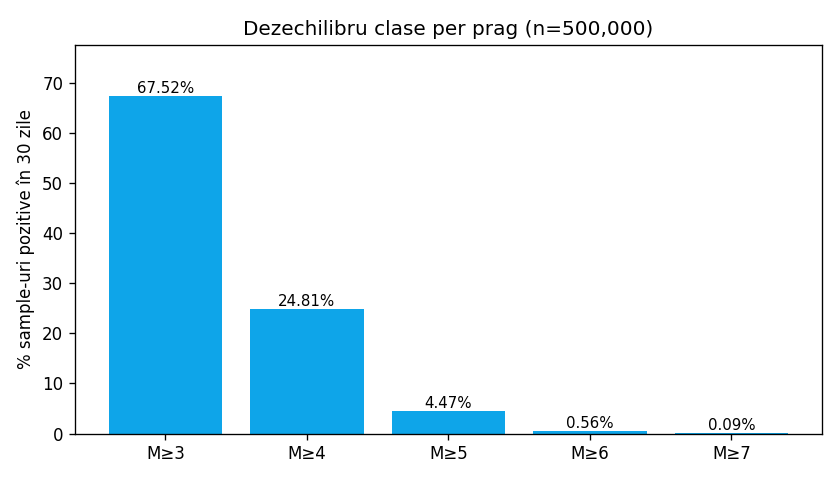
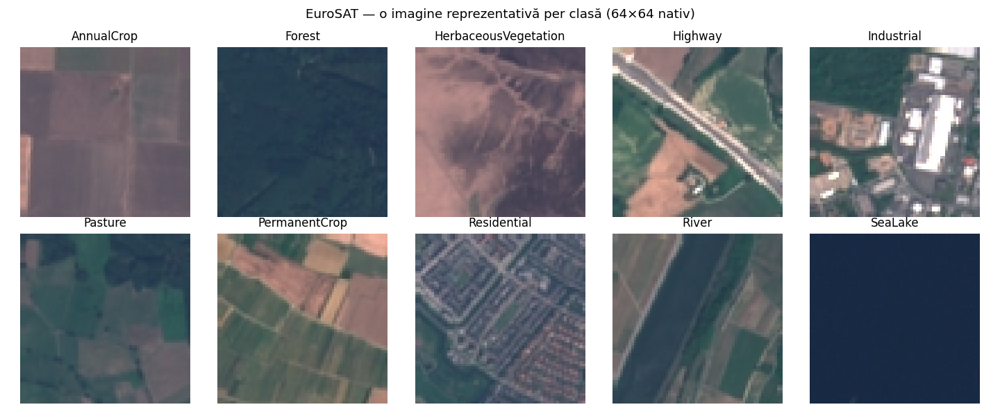

# Platformă de Prognoză a Cutremurelor

Hartă web care arată riscul de cutremur pentru orice locație. Folosește două modele AI: unul pe date structurate (catalog seismic) care estimează probabilitatea unui cutremur, și altul pe imagini satelitare care evaluează vulnerabilitatea terenului. Cele două se combină într-un singur scor de risc.

| | |
|---|---|
| **CNN test accuracy** | 97.89% pe EuroSAT (holdout 10%) |
| **LGBM ROC-AUC** | 0.65 – 0.87 (per prag M≥k) |
| **Acoperire** | Global (1990–2026, ~3.7M evenimente USGS) |
| **Stack** | FastAPI + LightGBM + PyTorch/MobileNetV3 + OpenVINO + Leaflet |

## Ce face aplicația

Apasă pe orice locație de pe harta lumii și vezi:

1. **Probabilitatea unui cutremur** de magnitudine M≥3 / M≥4 / M≥5 / M≥6 / M≥7 într-o zonă cu rază 10–500 km și un interval de la 1 zi până la 1 an (LightGBM).
2. **Gradul de vulnerabilitate** al terenului în raza selectată (MobileNetV3 pe imagini Sentinel-2).
3. **Scor combinat de risc** = probabilitate × vulnerabilitate.

**Beneficiari vizați:** public general curios, studenți/cercetători în geofizică, autorități locale (semnal complementar pentru prioritizare), filtru preliminar pentru industria asigurărilor.

**Obiective măsurabile:**

| Țintă | Status |
|---|---|
| ROC-AUC ≥ 0.75 pe M≥4, holdout post-2020 | atins (0.756) |
| CNN test accuracy ≥ 95% pe EuroSAT | atins (97.89%) |
| Latență `/forecast` < 1s end-to-end | atins |
| Pipeline reproductibil din clone | atins (seed=42 peste tot) |

## Arhitectura ML

```
   click pe          ┌─→ /forecast → LightGBM (5 ONNX) → P(M≥k) × 5    ← STRUCTURAT
   hartă (lat,lon) → ┤
                     └─→ /vulnerability → Esri tile → MobileNetV3      ← NESTRUCTURAT
                                       → scor 0–100

   risc = hazard × expunere
```

Riscul are nevoie de ambele componente: un M5 într-o pădure nelocuită are risc real ~0, același M5 sub un oraș are risc enorm. **LightGBM** estimează *hazardul* (probabilitatea evenimentului), **CNN** estimează *expunerea* (cât e construit acolo). Frontend-ul combină rezultatele în [frontend/script.js](frontend/script.js).

## Date și EDA

| Sursă | Conținut | Licență |
|---|---|---|
| USGS Earthquake Catalog | Catalog global de cutremure 1990–2026, ~3.7M evenimente | Domeniu public ([sursă](https://earthquake.usgs.gov/fdsnws/event/1/)) |
| INFP romplus | Catalog regional România (zona Vrancea), ~50k evenimente | Domeniu public ([sursă](https://www.infp.ro/data/romplus.txt)) |
| EuroSAT | Imagini Sentinel-2, 27.000 etichetate, 10 clase land-use | CC-BY (Helber et al. 2019, [GitHub](https://github.com/phelber/EuroSAT)) |
| Esri World Imagery | Tile-uri aeriene live pentru `/vulnerability` | Termenii Esri |

### Tabular (date structurate)

500.000 sample-uri `(lat, lon, dată)` cu 18 feature-uri (activitate recentă, statistici Gutenberg-Richter, distanță tectonică etc.) și 5 etichete binare `label_m{3..7}`. Detalii și grafice complete în [eval/tabular_eda.md](eval/tabular_eda.md).



**Dezechilibru extrem la praguri rare** (67.5% pozitive pentru M≥3, doar 0.09% pentru M≥7) → un model separat per prag cu `scale_pos_weight = n_neg / n_pos`. **Acoperire geografică** reflectă instrumentarea USGS (vezi limitări §Bias).

### Imagini (date nestructurate)

EuroSAT — 10 clase ~echilibrate (~2.700 imagini fiecare), 64×64 px nativ, upsampled la 224×224 pentru backbone-ul pretrenat. EDA completă în [eval/cnn_eda.md](eval/cnn_eda.md).



Inspecția vizuală a anticipat confuziile observate ulterior în matricea de confuzie: River ↔ Highway (forme liniare), Pasture ↔ HerbaceousVegetation (texturi verzi similare), Industrial ↔ Residential.

**Augmentări** (numai train): `RandomH/VFlip` (satelitar fără orientare canonică), `RandomRotation(15°)`, `ColorJitter` (variabilitate sezonieră). Normalizare cu ImageNet mean/std (obligatoriu pentru transfer learning).

## Modele

### LightGBM (tabular) — 5 modele, unul per prag

**De ce LightGBM:** ~3× mai rapid decât XGBoost pe 500k×18 features (histogram-based splits), `scale_pos_weight` nativ pentru imbalanced, ROC-AUC mai bun decât Random Forest pe rare classes. Logistic regression e ruled out — relațiile feature → label sunt nelinieare (Gutenberg-Richter este multiplicativ).

**Anti-overfitting:** `scale_pos_weight` + `min_child_samples` ∈ {20, 50, 100} + `num_leaves` ∈ {15, 31, 63} + early stopping pe set de validare independent + split temporal strict (testul = post-2020, antrenare = pre-2020, fără leakage).

**Hyperparameter search:** `RandomizedSearchCV(n_iter=6, cv=TimeSeriesSplit(3))` pe `num_leaves × min_child_samples × learning_rate`. TimeSeriesSplit, NU KFold — orice shuffle peste granița temporală ar fi leakage din viitor.

### MobileNetV3-Small (imagini) — transfer learning two-phase

**De ce transfer learning + MobileNetV3-Small:** un CNN custom from-scratch ajungea la ~88.7%; cu MobileNetV3 pretrenat pe ImageNet și fine-tune two-phase ajungem la 97.9% (vezi ablation §Rezultate). Vs ResNet18 — MobileNetV3 are 1.5M params (vs 11M), OpenVINO IR de 3.3MB (vs ~45MB), accuracy comparabilă. Vs EfficientNet — quirks la export ONNX/OpenVINO.

**Pipeline:**
- **Faza 1** (5 epoci): backbone înghețat, doar capul de 10 clase se antrenează (`lr=1e-3`, Adam). Previne ca gradientele random ale capului să scrambleze backbone-ul.
- **Faza 2** (10 epoci): unfreeze toate parametrii, `lr=1e-4` cu `CosineAnnealingLR`. Aici backbone-ul se adaptează la satelitar.

**Anti-overfitting:** augmentări + dropout intrinsec (MobileNetV3 are dropout în head) + LR scheduling cosine + holdout val 10% folosit doar pentru raportare (nu selecție arhitectură).

## Evaluare și rezultate

### Protocol

| | Tabular | CNN |
|---|---|---|
| Split | Temporal: train < 2020-01-01, test ≥ 2020-01-01 | Random 80/10/10 cu seed=42 |
| CV | `TimeSeriesSplit(3)` pe pre-2020 (în search-ul de hyperparam) | Single split (augmentări modelează varianța) |
| Anti-leakage | Sortare cronologică, niciodată shuffle peste 2020 | Seed fix, augmentări doar pe train |
| Metrici | Brier, LogLoss, ROC-AUC per prag | Accuracy + per-class P/R/F1 + confusion matrix |

### Tabular — LightGBM vs baseline constant (post-2020 holdout, 82.301 înregistrări)

| Prag | Rata pozitivă | Brier (LGBM) | Brier (baseline) | LogLoss (LGBM) | LogLoss (baseline) | ROC-AUC (LGBM) |
|---|---:|---:|---:|---:|---:|---:|
| M≥3 | 0.700 | **0.1389** | 0.2102 | **0.4277** | 0.6112 | **0.871** |
| M≥4 | 0.274 | **0.1773** | 0.1990 | **0.5329** | 0.5873 | **0.756** |
| M≥5 | 0.047 | 0.1263 | **0.0443** | 0.3903 | **0.1880** | **0.797** |
| M≥6 | 0.006 | 0.0509 | **0.0055** | 0.1537 | **0.0345** | **0.804** |
| M≥7 | 0.0005 | 0.1183 | **0.0005** | 1.8199 | **0.0041** | **0.649** |

**Baseline:** predictor constant care prezice rata empirică a clasei pozitive (AUC nedefinit — predicție constantă).

**Interpretare:** la pragurile dese (M≥3, M≥4) modelul bate baseline-ul pe toți indicatorii. La pragurile foarte rare (M≥5-7) baseline-ul are Brier/LogLoss mai mici — predicția "0.0005 pentru tot" e exquisit calibrată când pozitivele sunt <1% — dar **nu discriminează deloc** (AUC = 0.5), pe când modelul atinge AUC 0.65–0.80. Tradeoff clasic calibrare vs discriminare; modelul rămâne util pentru *ranking-ul* locațiilor după risc.

### CNN — ablation arhitectură (2.700 imagini test, seed=42)

| Model | Test accuracy | Comentariu |
|---|---:|---|
| Random predictor | 0.1015 | 10 clase ~echilibrate → ~10% |
| Majority class (`Residential`) | 0.1163 | prezice mereu clasa dominantă |
| SmallCNN custom (3 conv blocks, 8 epoci, fără transfer) | 0.8874 | arhitectura inițială |
| **MobileNetV3 + transfer learning + augmentări + 224×224** | **0.9789** | configurația curentă |

**Ablation Study:** trecerea de la un CNN simplu la transfer learning cu MobileNetV3-Small pretrenat pe ImageNet (cu fine-tune two-phase, augmentări și input 224x224) aduce **+9.1 puncte procentuale accuracy** pe același test split (seed=42).

| Clasă | Precision | Recall | F1 | Support |
|---|---:|---:|---:|---:|
| AnnualCrop | 0.967 | 0.967 | 0.967 | 300 |
| Forest | 0.990 | 0.990 | 0.990 | 297 |
| HerbaceousVegetation | 0.973 | 0.970 | 0.972 | 302 |
| Highway | 0.974 | 0.985 | 0.980 | 269 |
| Industrial | 0.996 | 0.977 | 0.986 | 257 |
| Pasture | 0.953 | 0.973 | 0.963 | 187 |
| PermanentCrop | 0.992 | 0.969 | 0.980 | 254 |
| Residential | 0.984 | 0.997 | 0.991 | 314 |
| River | 0.960 | 0.976 | 0.968 | 245 |
| SeaLake | 0.993 | 0.982 | 0.987 | 275 |

### Analiză de erori

- [eval/cnn_confusion_matrix.png](eval/cnn_confusion_matrix.png) — 57 erori din 2700 (2.1%). Confuzii dominante semantic apropiate: River ↔ Highway (5), HerbaceousVegetation ↔ Pasture (5), Industrial ↔ Residential (5).
- [eval/cnn_misclassified.png](eval/cnn_misclassified.png) — galerie cu 16 din 57 erori; majoritatea cazuri genuin ambigue chiar și pentru un observator uman.

## Limitări

- **Catalog USGS incomplet sub oceane și pre-1990** → modelul underpredice riscul în zone slab instrumentate.
- **Calibrare slabă la M≥7** — AUC 0.65 e doar marginal mai bun decât ghicit; folosiți cu rezervă pentru valori absolute. Pentru ranking rămâne util.
- **Fără modelare spațio-temporală** — fiecare punct prezis independent; clustering-ul aftershock-urilor nu e modelat.
- **Predicții pe 30 de zile, nu pe ore** — NU este sistem de alertă seismică.


## Etică și impact

- **Bias geografic:** acoperirea USGS e mai bună în USA / Japonia / Europa decât în oceane sau Africa sub-sahariană → modelul pare mai precis în regiunile bine instrumentate. **Bias cultural CNN:** EuroSAT e european; morfologii non-europene (slum-uri din Mumbai, favelas din São Paulo) pot fi clasificate eronat.
- **Confidențialitate:** doar date publice (USGS, INFP, EuroSAT, Esri); zero PII; aplicația nu loghează clicurile; imaginile încărcate la `/classify-image` nu se persistă.
- **Riscuri de utilizare incorectă:** **NU** e sistem de alertă, **NU** substituie standardele de construcție antiseismică, **NU** e opinie expert. Folosirea pentru decizii de evacuare ar fi periculoasă.
- **Utilizare responsabilă:** open-source, metrici și limitări transparente, modele deterministe (seed=42, reproducibilitate bit-cu-bit), etichetat clar ca proof-of-concept educațional. UI afișează SCĂZUT/MODERAT/RIDICAT — etichete categorice deliberat conservatoare pentru a evita iluzia de precizie.

## Instalare și rulare

```bash
# 1. Clonează
git clone https://github.com/octavh/earthquake_predictor.git
cd earthquake_predictor

# 2. Mediu virtual + dependențe
python3 -m venv .venv
source .venv/bin/activate
pip install -r librarii.txt

# 3. Descarcă datele (~13 ore, nu sunt în git din cauza dimensiunii)
python3 scripts/model1/download_data.py    # USGS + INFP
python3 scripts/model2/download_data.py    # EuroSAT

# 4. Pornește serverul (modelele sunt deja antrenate și incluse în models/)
uvicorn backend.main:app --reload
```

Deschide [http://127.0.0.1:8000/app/](http://127.0.0.1:8000/app/) și apasă pe hartă.

**Re-antrenare opțională:**
```bash
python scripts/model1/build_training_set.py    # reconstruiește training_set.csv (~10 ore)
python scripts/model1/train_tabular.py         # LightGBM cu CV + tuning (~15-25 min)
python scripts/model2/train_cnn.py             # CNN transfer learning (~15-25 min pe MPS/CUDA)
python scripts/export_openvino.py              # PyTorch → ONNX → OpenVINO IR
python eval/evaluate.py                        # refresh metrici + figuri
```

**API disponibil:**
- `/app/` — harta web
- `/forecast?lat=&lon=&days=&radius_km=` — LightGBM
- `/vulnerability?lat=&lon=&zoom=` — CNN pe tile satelitar
- `/classify-image` (POST) — CNN pe imagine arbitrară
- `/recent-quakes` — catalog quake-uri în zonă
- `/docs` — Swagger UI

## Structura proiectului

```
earthquake_predictor/
├── backend/                  # FastAPI: main.py, features.py (CatalogIndex + LandUseClassifier)
├── frontend/                 # Leaflet: index.html, script.js, style.css
├── scripts/
│   ├── model1/               # tabular: download_data, build_training_set, train_tabular
│   ├── model2/               # imagini: download_data, train_cnn
│   └── export_openvino.py    # PyTorch → ONNX → OpenVINO IR
├── eval/                     # evaluate.py + eda_*.py + figures/ + *.md
├── models/                   # lgbm_m*.onnx, cnn_eurosat.{pth,onnx,xml,bin}
├── data/                     # nu în git, generat de download_data
├── librarii.txt              # dependențe pip
└── README.md
```

## Librării utilizate

Python 3.11, FastAPI, Uvicorn, LightGBM, scikit-learn, PyTorch + torchvision, ONNX Runtime, OpenVINO, Leaflet, pandas, numpy, matplotlib, Pillow.

---

> Toate cifrele din README sunt reproductibile prin `python eval/evaluate.py` + scripturile EDA. Modelele sunt deterministe (seed=42).
